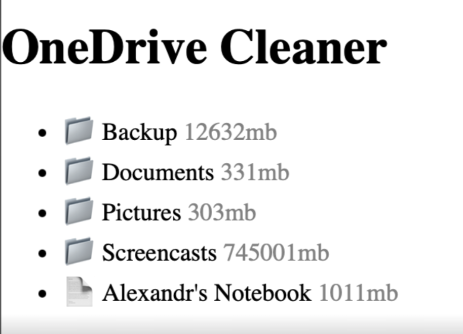

# OneDrive Cleaner

Super small sample to keep OneDrive clean

Key idea here is to use OneDrive API to traverse over files and find some well known items that we want to delete, like `node_modules`

## How it works

Technicall app may be splitten into two files

**index.html**

```html
<h1>OneDriveCleaner</h1>
<a
  href="https://login.microsoftonline.com/consumers/oauth2/v2.0/authorize?client_id=ba55dc5f-9b62-4574-9620-94da4787b0ba&scope=files.readwrite.all&response_type=token&redirect_uri=http://localhost:3000/callback.html"
  >Login</a
>
```

notes:

- there is no react/angular/vue/younameit - simple, plain html link
- we are using implicit flow, so there is no client secret to hide/rotate/revoke

**callback.html**

```html
<ul id="items"></ul>
<script>
  const hash = new URLSearchParams(window.location.hash.substring(1))
  const headers = { authorization: `${hash.get('token_type')} ${hash.get('access_token')}` }

  const { value } = await fetch('https://graph.microsoft.com/v1.0/me/drive/root/children', {headers}).then(r => r.json())

  document.getElementById('items').innerHTML = values.map(({name}) => `<li>${name}</li>`).join('')
</script>
```



## How to run it

any web server will be fine, aka:

```bash
npx lite-server
```

## Authentication

[AppRegistration](https://portal.azure.com/#view/Microsoft_AAD_RegisteredApps/ApplicationMenuBlade/~/Overview/appId/ba55dc5f-9b62-4574-9620-94da4787b0ba/isMSAApp~/false)

| key          | val                                  |
| ------------ | ------------------------------------ |
| client_id    | ba55dc5f-9b62-4574-9620-94da4787b0ba |
| redirect_uri | http://localhost:3000/               |

Notes:

- there is no need to have client secret - we wont be using code flow
- make sure to enable implicit flow under authenticaion section of azure app registration
